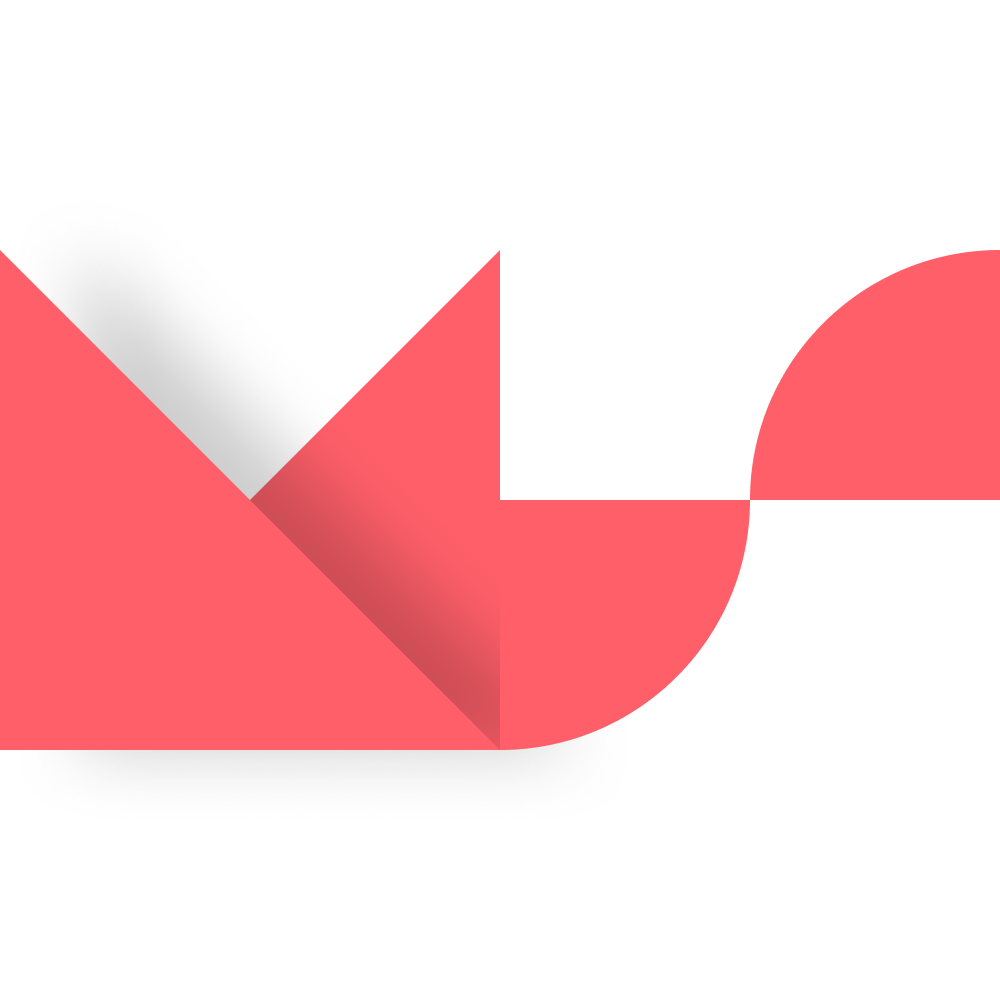
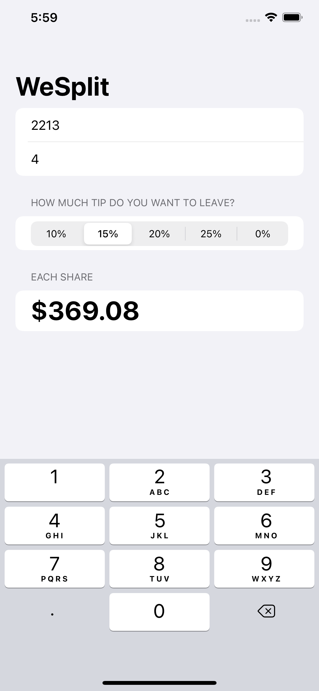

# WeSplit

Bills Splitting App: SwiftUI

### **Preview**

**What I have learned** 

1. Understanding the basic structure of a SwiftUI app
    - AppDelegate
    - SceneDelegate
    - ContentView
    - Assets
    - Info.plist
    - PreviewContent
2. Creating a Form
    - Groups
    - Sections
3. Adding a navigation bar
    - Adding NavigationView
    - NavigationBarTitle
4. Modifying program state
    - What is State ?
    - Declaring a State
    - How to Change a State
5. Binding state to user interface controls
    - Binding State Property with $
6. Creating views in a loop
    - Using a same view with ForEach Loop
7. Reading text from the user with TextField
8. Creating pickers in a form
9. Adding a segmented control for tip percentages
10. Calculating the total per person
11. Changed Picker to TextField
12. Wrap Up ✌️